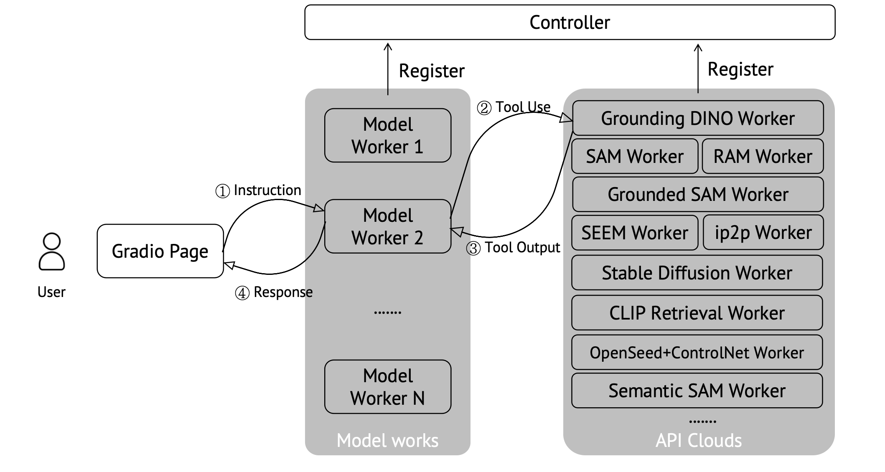

# 🌋  LLaVA-Plus: Large Language and Vision Assistants that Plug and Learn to Use Skills


**Learning to Use Tools For Creating Multimodal Agents.**

[[Project Page](https://llava-vl.github.io/llava-plus)] [[Arxiv](https://arxiv.org/abs/2311.05437)]  [[Demo](https://llavaplus.ngrok.io/)]  [[Data](https://huggingface.co/datasets/LLaVA-VL/llava-plus-data)] [[Model Zoo](https://github.com/LLaVA-VL/LLaVA-Plus-Codebase/blob/main/docs/llava-plus/modelzoo.md)] 

**Note: Some sections of the code are currently being prepared and updated. Please stay tuned.**


## Release
- [11/11] 🔥 We released **LLaVA-Plus: Large Language and Vision Assistants that Plug and Learn to Use Skills**. Enable LMM to use tools for general vision tasks! Checkout the [paper]() and [demo](https://llavaplus.ngrok.io/).


[](https://github.com/tatsu-lab/stanford_alpaca/blob/main/LICENSE)
[](https://github.com/tatsu-lab/stanford_alpaca/blob/main/DATA_LICENSE)
**Usage and License Notices**: The data and checkpoint are intended and licensed for research use only. They are also restricted to uses that follow the license agreement of LLaVA, LLaMA, Vicuna, and GPT-4. The dataset is CC BY NC 4.0 (allowing only non-commercial use) and models trained using the dataset should not be used outside of research purposes.


## Contents
- [Install](#install)
- [LLaVA-Plus Weights](#llava-plus-weights)
- [Demo](#demo)
- [Model Zoo](docs/llava-plus/modelzoo.md)
- [Dataset](docs/llava-plus/dataset.md)
- [Train](#train)
- [Evaluation](#evaluation)

## Install

If you are not using Linux, do *NOT* proceed, see instructions for [macOS](https://github.com/haotian-liu/LLaVA/blob/main/docs/macOS.md) and [Windows](https://github.com/haotian-liu/LLaVA/blob/main/docs/Windows.md) from LLaVA.

1. Clone this repository and navigate to the LLaVA-Plus folder
```bash
git clone https://github.com/LLaVA-VL/LLaVA-Plus-Codebase LLaVA-Plus
cd LLaVA-Plus
```

2. Install Package
```Shell
conda create -n llava python=3.10 -y
conda activate llava
pip install --upgrade pip  # enable PEP 660 support
pip install -e .
```

3. Install additional packages for training cases
```
pip install -e ".[train]"
pip install flash-attn --no-build-isolation
```

## LLaVA-Plus Weights

**We are still preparing the part. Stay tuned!**

Please check out our [Model Zoo](https://github.com/LLaVA-VL/LLaVA-Plus-Codebase/blob/main/docs/llava-plus/modelzoo.md) for all public LLaVA-Plus checkpoints, and the instructions on how to use the weights.

## Demo

- [Demo: https://llavaplus.ngrok.io/](https://llavaplus.ngrok.io/)

### Demo Architecture




To run our demo, you have four steps.

1. [Launch a controller](#1-Launch-a-controller): enable to control different works.
2. [Launch a model worker](#2-Launch-a-model-worker): core llava-plus model.
3. [Launch tool workers](#3-Launch-tool-workers): the tools you want to call.
4. [Launch a gradio web server](#4-Launch-a-gradio-web-server): a front end page for users.

#### 1. Launch a controller
```Shell
python -m llava.serve.controller --host 0.0.0.0 --port 20001
```

#### 2. Launch a model worker

This is the actual *worker* that performs the inference on the GPU.  Each worker is responsible for a single model specified in `--model-path`.

```Shell
python -m llava.serve.model_worker --host 0.0.0.0 --controller http://localhost:20001 --port 40000 --worker http://localhost:40000 --model-path <huggingface or local path>
```

Wait until the process finishes loading the model and you see "Uvicorn running on ...".  Now, refresh your Gradio web UI, and you will see the model you just launched in the model list.

If you are using an Apple device with an M1 or M2 chip, you can specify the mps device by using the `--device` flag: `--device mps`.

<details>
<summary>Multiple works</summary>
You can launch as many workers as you want, and compare between different model checkpoints in the same Gradio interface. Please keep the `--controller` the same, and modify the `--port` and `--worker` to a different port number for each worker.
```Shell
python -m llava.serve.model_worker --host 0.0.0.0 --controller http://localhost:20001 --port <different from 40000, say 40001> --worker http://localhost:<change accordingly, i.e. 40001> --model-path <ckpt2>
```
</details>


<details>
<summary>Launch a model worker (Multiple GPUs, when GPU VRAM <= 24GB)</summary>

If the VRAM of your GPU is less than 24GB (e.g., RTX 3090, RTX 4090, etc.), you may try running it with multiple GPUs. Our latest code base will automatically try to use multiple GPUs if you have more than one GPU. You can specify which GPUs to use with `CUDA_VISIBLE_DEVICES`. Below is an example of running with the first two GPUs.

```Shell
CUDA_VISIBLE_DEVICES=0,1 python -m llava.serve.model_worker --host 0.0.0.0 --controller http://localhost:20001 --port 40000 --worker http://localhost:40000 --model-path <huggingface or local path>
```
</details>

#### 3. Launch tool workers
You need to open different tool works, as shown in the figure above, which means you need to prepare codes from other projects.

We provide a detailed [guideline](docs/llava-plus/tools.md) for different projects.


#### 4. Launch a gradio web server.
```Shell
python -m llava.serve.gradio_web_server_llava_plus --controller http://localhost:20001 --model-list-mode reload
```
You just launched the Gradio web interface. Now, you can open the web interface with the URL printed on the screen. 


## Train


LLaVA training consists of two stages: (1) feature alignment stage, and  (2) visual instruction tuning stage.

Our llava-plus is trained from the llava-stage-1-pre-trained projectors.

<details>
<summary>Training cost</summary>
LLaVA-Plus is trained on 4/8 A100 GPUs with 80GB memory. To train on fewer GPUs, you can reduce the `per_device_train_batch_size` and increase the `gradient_accumulation_steps` accordingly. Always keep the global batch size the same: `per_device_train_batch_size` x `gradient_accumulation_steps` x `num_gpus`.
</details>


<details>
<summary>Download Vicuna checkpoints (automatically)</summary>

Our base model Vicuna v1.5, which is an instruction-tuned chatbot, will be downloaded automatically when you run our provided training scripts. No action is needed.
</details>

### Stage 1: Pretrain (feature alignment)

Download [pre-trained projector](https://github.com/haotian-liu/LLaVA/blob/main/docs/MODEL_ZOO.md#projector-weights) directly as we did.

Or you may train the projector following the [guideline in LLaVA](https://github.com/haotian-liu/LLaVA/tree/main#pretrain-feature-alignment).


### Stage 2: Tool Augmented Visual Instruction Tuning

1. Prepare data

Please download [the training data](https://huggingface.co/datasets/LLaVA-VL/llava-plus-data), and download the images from constituting datasets:

- COCO: [train2017](http://images.cocodataset.org/zips/train2017.zip)
- VisualGenome: [part1](https://cs.stanford.edu/people/rak248/VG_100K_2/images.zip), [part2](https://cs.stanford.edu/people/rak248/VG_100K_2/images2.zip)
- [infoseek](https://open-vision-language.github.io/infoseek/)
- [hiertext](https://github.com/google-research-datasets/hiertext)

2. Start training!

Training script with DeepSpeed ZeRO-2: [`training_llava_plus_v0_7b.sh`](scripts/llava_plus/training_llava_plus_v0_7b.sh) or [`training_llava_plus_v1.3_7b.sh`](scripts/llava_plus/training_llava_plus_v1.3_7b.sh)


<details>
<summary>If you do not have enough GPU memory:</summary>
- Use LoRA. See LLaVA repo for more details.
- Replace `zero2.json` with `zero3.json` or `zero3_offload.json`.
</details>

<details>
<summary>If you are interested in finetuning LLaVA(LLaVA-Plus) model to your own task/data:</summary>
please check out [`Finetune_Custom_Data.md`](https://github.com/haotian-liu/LLaVA/blob/main/docs/Finetune_Custom_Data.md)。
</details>
<details>
<summary>Some explainations of options:</summary>

- `--data_path path/to/llava-150k-tool-aug.json,path/to/llava-plus-v1-117k-tool-merge.json`: You may pass multiple data files with `,` separated.
- `--image_folder /path/to/coco/train2017/,/path/to/hiertext/train,/path/to/infoseek/infoseek_images,/path/to/instruct-pix2pix/clip-filtered-dataset,/path/to/goldg/vg_mdetr/images`: You may pass multiple image folders with `,` separated. Note that it may cause problems if multiple folders have images with the same name.
- `--mm_projector_type mlp2x_gelu`: the two-layer MLP vision-language connector.
- `--vision_tower openai/clip-vit-large-patch14-336`: CLIP ViT-L/14 336px.
- `--image_aspect_ratio pad`: this pads the non-square images to square, instead of cropping them; it slightly reduces hallucination.
- `--group_by_modality_length True`: this should only be used when your instruction tuning dataset contains both language (e.g. ShareGPT) and multimodal (e.g. LLaVA-Instruct). It makes the training sampler only sample a single modality (either image or language) during training, which we observe to speed up training by ~25%, and does not affect the final outcome.
</details>

## Evaluation

See [LLaVA's Instruction](https://github.com/haotian-liu/LLaVA/tree/main#evaluation) on model evaluations.

## Citation

If you find LLaVA useful for your research and applications, please cite using this BibTeX:
```bibtex

@article{liu2023llavaplus,
  title={LLaVA-Plus: Learning to Use Tools for Creating Multimodal Agents},
  author={Liu, Shilong and Cheng, Hao and Liu, Haotian and Zhang, Hao and Li, Feng and Ren, Tianhe and Zou, Xueyan and Yang, Jianwei and Su, Hang and Zhu, Jun and Zhang, Lei and Gao, Jianfeng and Li, Chunyuan},
  journal={arXiv:2311.05437},
  year={2023}
}

@misc{liu2023llava,
      title={Visual Instruction Tuning}, 
      author={Liu, Haotian and Li, Chunyuan and Wu, Qingyang and Lee, Yong Jae},
      publisher={arXiv:2304.08485},
      year={2023}
}
```

## Acknowledgement

- [LLaVA](https://github.com/haotian-liu/LLaVA), [Vicuna](https://github.com/lm-sys/FastChat): Thanks to their amazing codebase.


## Related Projects
- [LLaVA](https://llava-vl.github.io/)

Included Tools
- [Grounding DINO](https://github.com/IDEA-Research/GroundingDINO)
- [Grounded-Segment-Anything](https://github.com/IDEA-Research/Grounded-Segment-Anything)
- [Recognize Anythging](https://github.com/xinyu1205/recognize-anything)
- [Segment-Anything](https://github.com/facebookresearch/segment-anything).
- [SEEM: Segment Everything Everywhere All at Once](https://github.com/UX-Decoder/Segment-Everything-Everywhere-All-At-Once)
- [Semantic-SAM](https://github.com/UX-Decoder/Semantic-SAM)
- [Segment-Anything](https://github.com/facebookresearch/segment-anything)


For future project ideas, please check out:
- [Instruction Tuning with GPT-4](https://github.com/Instruction-Tuning-with-GPT-4/GPT-4-LLM)
- [LLaVA-Med: Training a Large Language-and-Vision Assistant for Biomedicine in One Day](https://github.com/microsoft/LLaVA-Med)
- [Otter: In-Context Multi-Modal Instruction Tuning](https://github.com/Luodian/Otter)
