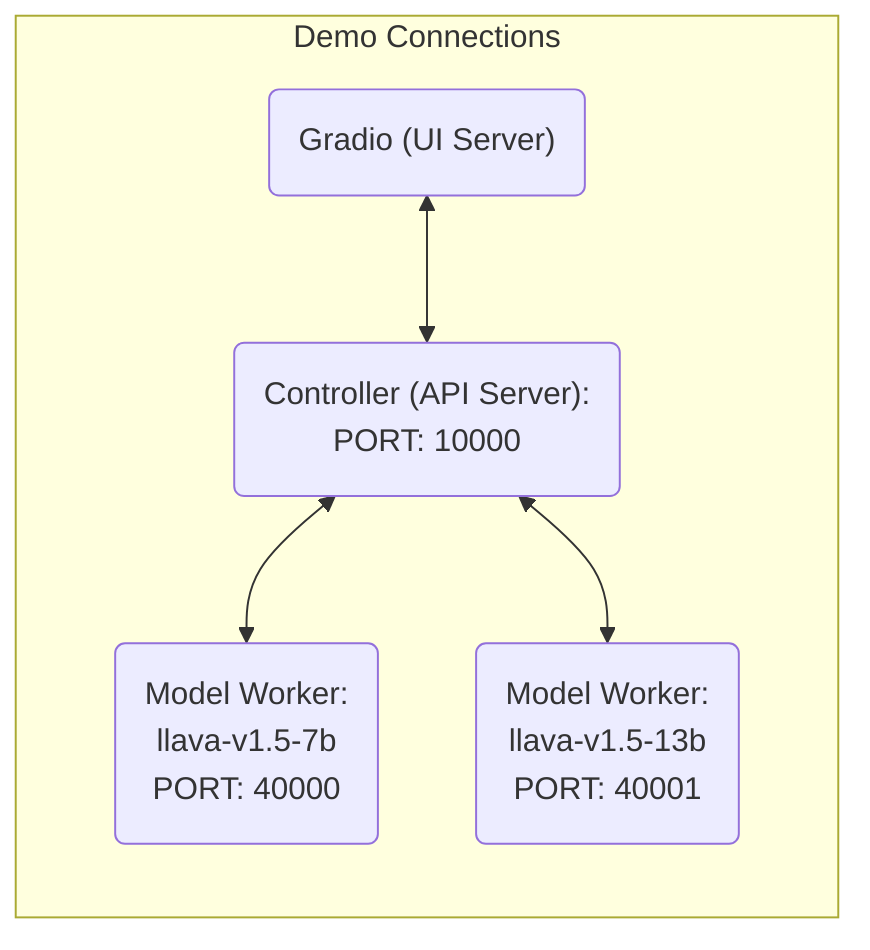

# 🌋  LLaVA-Plus: Large Language and Vision Assistants that Plug and Learn to Use Skills


**Learning to Use Tools For Creating Multimodal Agents.**

[[Project Page](https://llava-vl.github.io/llava-plus)] [[Arxiv](https://arxiv.org/abs/2311.05437)]  [[Demo](https://llavaplus.ngrok.io/)]  [[Data](https://huggingface.co/datasets/LLaVA-VL/llava-plus-data)] [[Model Zoo]()] 

***Note: Some parts of the code are still under preparations. Keep Tuned!*


## Release
- [11/11] 🔥 We released **LLaVA-Plus: Large Language and Vision Assistants that Plug and Learn to Use Skills**. Enable LMM to use tools for general vision tasks! Checkout the [paper]() and [demo](https://llavaplus.ngrok.io/).


[](https://github.com/tatsu-lab/stanford_alpaca/blob/main/LICENSE)
[](https://github.com/tatsu-lab/stanford_alpaca/blob/main/DATA_LICENSE)
**Usage and License Notices**: The data and checkpoint is intended and licensed for research use only. They are also restricted to uses that follow the license agreement of LLaVA, LLaMA, Vicuna and GPT-4. The dataset is CC BY NC 4.0 (allowing only non-commercial use) and models trained using the dataset should not be used outside of research purposes.


## Contents
- [Install](#install)
- [LLaVA-Plus Weights](#llava-plus-weights)
- [Demo](#Demo)
- [Model Zoo](docs/llava-plus/modelzoo.md)
- [Dataset](docs/llava-plus/dataset.md)
- [Train](#train)
- [Evaluation](#evaluation)

## Install

If you are not using Linux, do *NOT* proceed, see instructions for [macOS](https://github.com/haotian-liu/LLaVA/blob/main/docs/macOS.md) and [Windows](https://github.com/haotian-liu/LLaVA/blob/main/docs/Windows.md) from LLaVA.

1. Clone this repository and navigate to LLaVA-Plus folder
```bash
git clone https://github.com/LLaVA-VL/LLaVA-Plus-Codebase LLaVA-Plus
cd LLaVA-Plus
```

2. Install Package
```Shell
conda create -n llava python=3.10 -y
conda activate llava
pip install --upgrade pip  # enable PEP 660 support
pip install -e .
```

3. Install additional packages for training cases
```
pip install -e ".[train]"
pip install flash-attn --no-build-isolation
```

## LLaVA-Plus Weights

**We are still preparing the part. Stay tuned!**

Please check out our [Model Zoo](https://github.com/haotian-liu/LLaVA/blob/main/docs/MODEL_ZOO.md) for all public LLaVA-Plus checkpoints, and the instructions of how to use the weights.

## Demo

To run our demo, you need to prepare LLaVA checkpoints locally.  Please follow the instructions [here](#LLaVA-Plus-Weights) to download the checkpoints.

### Gradio Web UI

To launch a Gradio demo locally, please run the following commands one by one. If you plan to launch multiple model workers to compare between different checkpoints, you only need to launch the controller and the web server *ONCE*.



#### Launch a controller
```Shell
python -m llava.serve.controller --host 0.0.0.0 --port 20001
```

#### Launch a gradio web server.
```Shell
python -m llava.serve.gradio_web_server_llava_plus --controller http://localhost:20001 --model-list-mode reload
```
You just launched the Gradio web interface. Now, you can open the web interface with the URL printed on the screen. You may notice that there is no model in the model list. Do not worry, as we have not launched any model worker yet. It will be automatically updated when you launch a model worker.

#### Launch a model worker

This is the actual *worker* that performs the inference on the GPU.  Each worker is responsible for a single model specified in `--model-path`.

```Shell
python -m llava.serve.model_worker --host 0.0.0.0 --controller http://localhost:20001 --port 40000 --worker http://localhost:40000 --model-path <huggingface or local path>
```
Wait until the process finishes loading the model and you see "Uvicorn running on ...".  Now, refresh your Gradio web UI, and you will see the model you just launched in the model list.

You can launch as many workers as you want, and compare between different model checkpoints in the same Gradio interface. Please keep the `--controller` the same, and modify the `--port` and `--worker` to a different port number for each worker.
```Shell
python -m llava.serve.model_worker --host 0.0.0.0 --controller http://localhost:20001 --port <different from 40000, say 40001> --worker http://localhost:<change accordingly, i.e. 40001> --model-path <ckpt2>
```

If you are using an Apple device with an M1 or M2 chip, you can specify the mps device by using the `--device` flag: `--device mps`.

#### Launch a model worker (Multiple GPUs, when GPU VRAM <= 24GB)

If the VRAM of your GPU is less than 24GB (e.g., RTX 3090, RTX 4090, etc.), you may try running it with multiple GPUs. Our latest code base will automatically try to use multiple GPUs if you have more than one GPU. You can specify which GPUs to use with `CUDA_VISIBLE_DEVICES`. Below is an example of running with the first two GPUs.

```Shell
CUDA_VISIBLE_DEVICES=0,1 python -m llava.serve.model_worker --host 0.0.0.0 --controller http://localhost:20001 --port 40000 --worker http://localhost:40000 --model-path <huggingface or local path>
```

## Train

**Our model is finetuned based on the first stage LLaVA models.**

LLaVA training consists of two stages: (1) feature alignment stage: use our 558K subset of the LAION-CC-SBU dataset to connect a *frozen pretrained* vision encoder to a *frozen LLM*; (2) visual instruction tuning stage: use 150K GPT-generated multimodal instruction-following data, plus around 515K VQA data from academic-oriented tasks, to teach the model to follow multimodal instructions.

LLaVA-Plus is trained on 4/8 A100 GPUs with 80GB memory. To train on fewer GPUs, you can reduce the `per_device_train_batch_size` and increase the `gradient_accumulation_steps` accordingly. Always keep the global batch size the same: `per_device_train_batch_size` x `gradient_accumulation_steps` x `num_gpus`.

### Download Vicuna checkpoints (automatically)

Our base model Vicuna v1.5, which is an instruction-tuned chatbot, will be downloaded automatically when you run our provided training scripts. No action is needed.


### Stage 1: Pretrain (feature alignment, we use the LLaVA checkpoint directly)

See the [LLaVA Pre-training](https://github.com/haotian-liu/LLaVA/tree/main#pretrain-feature-alignment) for the first stage training(feature alignment).


### Stage 2: Tool Augmented Visual Instruction Tuning

1. Prepare data

Please download [the training data](https://huggingface.co/datasets/LLaVA-VL/llava-plus-data), and download the images from constituting datasets:

- COCO: [train2017](http://images.cocodataset.org/zips/train2017.zip)
- VisualGenome: [part1](https://cs.stanford.edu/people/rak248/VG_100K_2/images.zip), [part2](https://cs.stanford.edu/people/rak248/VG_100K_2/images2.zip)
- [infoseek](https://open-vision-language.github.io/infoseek/)
- [hiertext](https://github.com/google-research-datasets/hiertext)

Our scripts support multi-source data and image folders. Seperate each item with `,`.

2. Start training!

You may download LLaVA pretrained projectors in [Model Zoo](https://github.com/haotian-liu/LLaVA/blob/main/docs/MODEL_ZOO.md). 

Visual instruction tuning takes around 25 hours for LLaVA-Plus-7B on 4x A100 (80G), due to the increased resolution to 336px. It takes around 30 hours for LLaVA-Plus-13B-LLaVA-1.5 on 8x A100 (80G).

Training script with DeepSpeed ZeRO-2: [`training.sh`](scripts/llava_plus/training.sh).

If you are do not have enough GPU memory:

- Use LoRA. See LLaVA repo for more details.
- Replace `zero3.json` with `zero3_offload.json` which offloads some parameters to CPU RAM. This slows down the training speed.

If you are interested in finetuning LLaVA(LLaVA-Plus) model to your own task/data, please check out [`Finetune_Custom_Data.md`](https://github.com/haotian-liu/LLaVA/blob/main/docs/Finetune_Custom_Data.md)。

New options to note:

- `--mm_projector_type mlp2x_gelu`: the two-layer MLP vision-language connector.
- `--vision_tower openai/clip-vit-large-patch14-336`: CLIP ViT-L/14 336px.
- `--image_aspect_ratio pad`: this pads the non-square images to square, instead of cropping them; it slightly reduces hallucination.
- `--group_by_modality_length True`: this should only be used when your instruction tuning dataset contains both language (e.g. ShareGPT) and multimodal (e.g. LLaVA-Instruct). It makes the training sampler only sample a single modality (either image or language) during training, which we observe to speed up training by ~25%, and does not affect the final outcome.

## Evaluation

See [LLaVA's Instruction](https://github.com/haotian-liu/LLaVA/tree/main#evaluation) on model evaluations.

## Citation

If you find LLaVA useful for your research and applications, please cite using this BibTeX:
```bibtex

@misc{liu2023llavaplus,
    title={LLaVA-Plus: Learning to Use Tools for Creating Multimodal Agents},
    author={Shilong Liu and Hao Cheng and Haotian Liu and Hao Zhang and Feng Li and Tianhe Ren and Xueyan Zou and Jianwei Yang and Hang Su and Jun Zhu and Lei Zhang and Jianfeng Gao and Chunyuan Li},
    year={2023},
    booktitle={arXiv}
}

@misc{liu2023llava,
      title={Visual Instruction Tuning}, 
      author={Liu, Haotian and Li, Chunyuan and Wu, Qingyang and Lee, Yong Jae},
      publisher={arXiv:2304.08485},
      year={2023},
}
```

## Acknowledgement

- [LLaVA](https://github.com/haotian-liu/LLaVA), [Vicuna](https://github.com/lm-sys/FastChat): Thanks to their amazing codebase.


## Related Projects
- [LLaVA](https://llava-vl.github.io/)

Included Tools
- [Grounding DINO](https://github.com/IDEA-Research/GroundingDINO)
- [Grounded-Segment-Anything](https://github.com/IDEA-Research/Grounded-Segment-Anything)
- [Recognize Anythging](https://github.com/xinyu1205/recognize-anything)
- [Segment-Anything](https://github.com/facebookresearch/segment-anything).
- [SEEM: Segment Everything Everywhere All at Once](https://github.com/UX-Decoder/Segment-Everything-Everywhere-All-At-Once)
- [Semantic-SAM](https://github.com/UX-Decoder/Semantic-SAM)
- [Segment-Anything](https://github.com/facebookresearch/segment-anything)


For future project ideas, please check out:
- [Instruction Tuning with GPT-4](https://github.com/Instruction-Tuning-with-GPT-4/GPT-4-LLM)
- [LLaVA-Med: Training a Large Language-and-Vision Assistant for Biomedicine in One Day](https://github.com/microsoft/LLaVA-Med)
- [Otter: In-Context Multi-Modal Instruction Tuning](https://github.com/Luodian/Otter)
